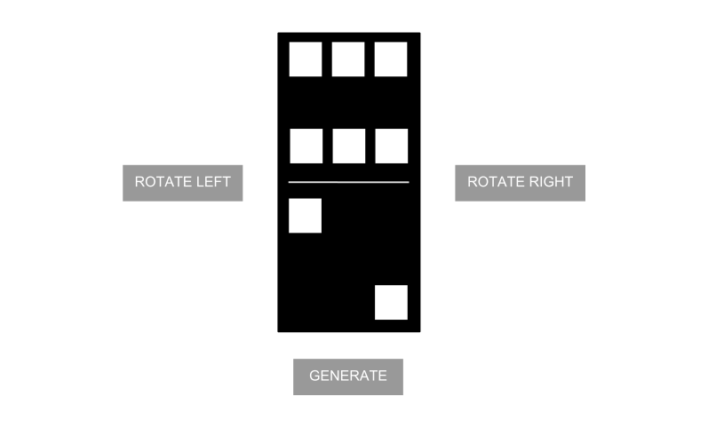

Domino
===========

__This is a timed 50 minute exercise.__

### Task 

Write css, html and javascript necessary to populate a domino with random values for its top and bottom faces when a button is clicked. 

### UI Mockup

### Component requirements

1.  Clicking the "Generate" button will populate the domino with a random number of dots on each face.
2.  Dominos can have no dots on a face.
3.  Clicking the "Rotate Left" or "Rotate Right" buttons will rotate the domino left or right.  You can use CSS transforms to achieve the rotation.
4.  [Optional] Make it pretty.

### Code requirements

1.  You can use base JavaScript libraries such as jQuery, underscore.js, Backbone.js, etc.
2.  Submit code in a [JSFiddle](http://jsfiddle.net) so that it can be easily viewed and analyzed.
